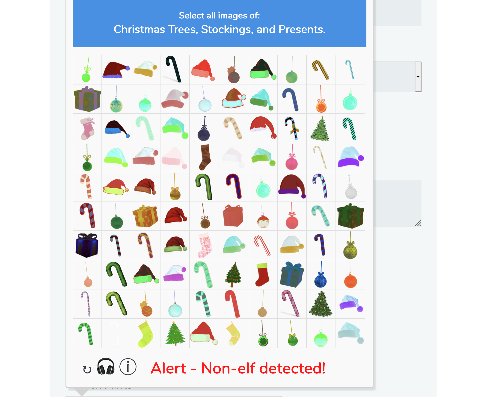

# KringleCon - Holiday Hack Challenge - 2019

Adapted from https://github.com/chrisjd20/img_rec_tf_ml_demo

Goal of the challenge: solve the CAPTEHA on the website: https://fridosleigh.com/



## Installation:

```bash
git clone https://github.com/chrisjd20/img_rec_tf_ml_demo.git
cd img_rec_tf_ml_demo
sudo apt install python3 python3-pip -y
sudo python3 -m pip install --upgrade pip
sudo python3 -m pip install --upgrade setuptools
sudo python3 -m pip install --upgrade tensorflow==1.15
sudo python3 -m pip install tensorflow_hub   #this one may or may not be needed in order to run
```

## Training the ML Model based on images from Krampus:

This will take a long time on 12000 images!

```
python3 retrain.py --image_dir ./capteha_images/
```
<sub><sup>`retrain.py` is a slightly modified version of https://raw.githubusercontent.com/tensorflow/hub/master/examples/image_retraining/retrain.py</sup></sub>

This will create two files we will be using at:

1. `/tmp/retrain_tmp/output_graph.pb`     - Trained Machine Learning Model
2. `/tmp/retrain_tmp/output_labels.txt`   - Labels for Images

## Testing prediction on  `unknown_images` using the trained Model:
```
chmod 755 predict_images_using_trained_model.py
./predict_images_using_trained_model.py
```

## Solving the CAPTEHA objective:

Remember to update your email in the source code to get the code from the Frido Sleigh challenge:

```
python3 capteha_api.py
```

## Remove Temp Cache Files Between Different Retrains

```
rm -rf /tmp/retrain_tmp /tmp/tfhub_modules
```
